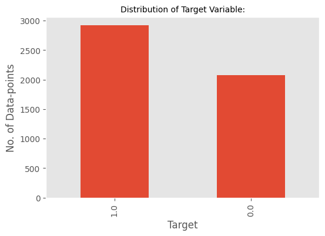

# Anomaly-Detection-of-ECG-using-AutoEncoders
An electrocardiogram — also called ECG or EKG — is often done in a health care provider's office, a clinic or a hospital room. ECG machines are standard equipment in operating rooms and ambulances. Some personal devices, such as smartwatches, offer ECG monitoring. Ask your health care provider if this is an option for you
### 1. Objective : Detect Anomaly detection of ECG using AutoEncoders based on its reconstruction error.

### 1.1 Attribute Information
We have 141 features out of which 140 features are use to measures the heart activity.
### 1.2 Target Variable
As a binary data Category 1 means Normal activity, 0 means abnormal activity.

### 2. Exploratory Data Analysis 
#### 2.1 Distribution of data points among Target Variable

### 3.1 Normal ECG

### 3.2  Abnormal ECG

