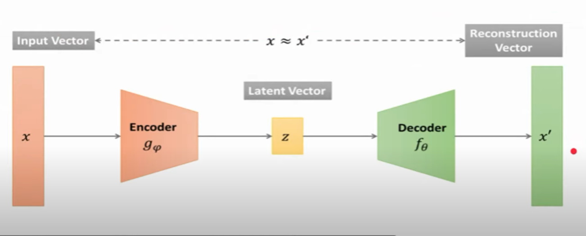
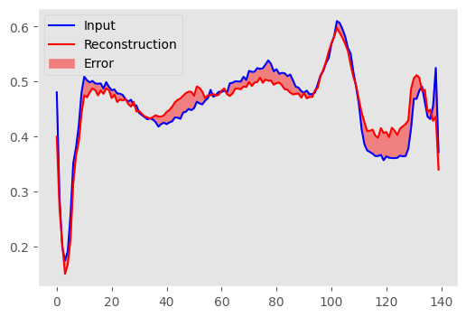
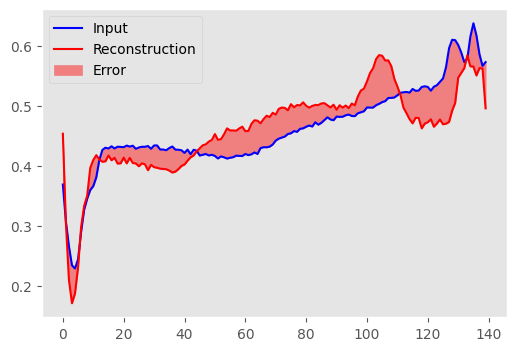
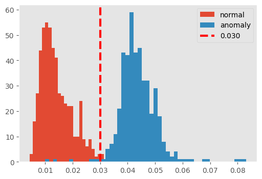

# Anomaly-Detection-of-ECG-using-AutoEncoders
An electrocardiogram — also called ECG or EKG — is often done in a health care provider's office, a clinic or a hospital room. ECG machines are standard equipment in operating rooms and ambulances. Some personal devices, such as smartwatches, offer ECG monitoring. Ask your health care provider if this is an option for you
### 1. Objective : Detect Anomaly detection of ECG using AutoEncoders based on its reconstruction error.

### 1.1 Attribute Information
We have 141 features out of which 140 features are use to measures the heart activity.
### 1.2 Target Variable
As a binary data Category 1 means Normal activity, 0 means abnormal activity.

### 2. Exploratory Data Analysis 
#### 2.1 Distribution of data points among Target Variable

### 3.1 Normal ECG

Observation: Initially there is a drop in ECG as it is beginning of ECG measurement, but after that it is at normal throughout.

### 3.2  Abnormal ECG 

Observation: In Abnormal it is normal at beginning but as it go forwards there is much higher drop than beginning.

### 4.1 Using Auto-Encoder

Diffrence between Input and Output is Reconstruction Error

Note: Reconstruction Error for Anomaly data will be very high, and that will help us to determine wheater the output is Anomaly or Normal

Normal data

Abnormal data

### 4.2 Comparison of Normal & Anomaly ECG using Threshold

Observation:
There are some blue data (Anomaly) in our orange data - False Positive
As it is Anomaly but as our Threshold it will predict Normal
We can move our threshold as per our condition

#### Conclusion:

So using our Threshold we can predict Anomaly detection and for normal detection.
